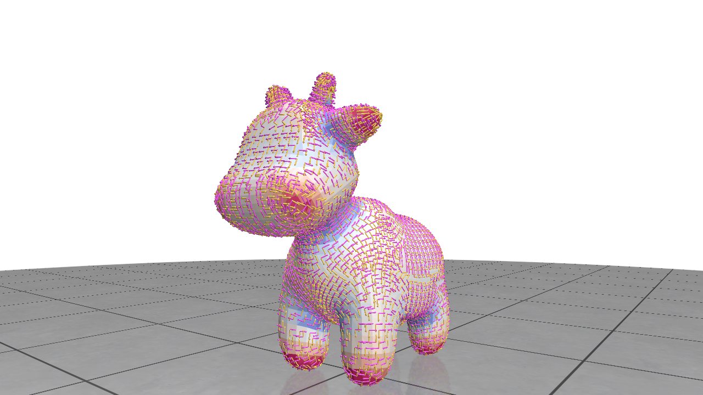

# Interpolated corrected curvature measures for polygonal surfaces

This repository is demo of the "Interpolated corrected curvature
measures for polygonal surfaces" article.


To use this project, just clone it (with submodule):

```
git clone --recursive https://github.com/dcoeurjo/PolyscopeCNC.git
```

Then you can compile the example file using:

```
mkdir build
cd build
cmake ..
make
```
Consider using  `cmake -DCMAKE_BUILD_TYPE=Release` for faster computation.
*Note*: to compile DGtal, you would need [boost](boost.org) (only headers) and  [zlib](https://www.zlib.net).


Once the code has been built, just run *simpleTest* on a triangulated
OBJ file:

```
simpleTest ../spot.obj
```



## Authors

* [Jacques-Olivier Lachaud](http://www.lama.univ-savoie.fr/pagesmembres/lachaud/People/LACHAUD-JO/person.html)
* [Boris Thibert](https://ljk.imag.fr/membres/Boris.Thibert/)
* [Pascal Romon](https://perso.math.u-pem.fr/romon.pascal/)
* [David Coeurjolly](http://perso.liris.cnrs.fr/david.coeurjolly)

